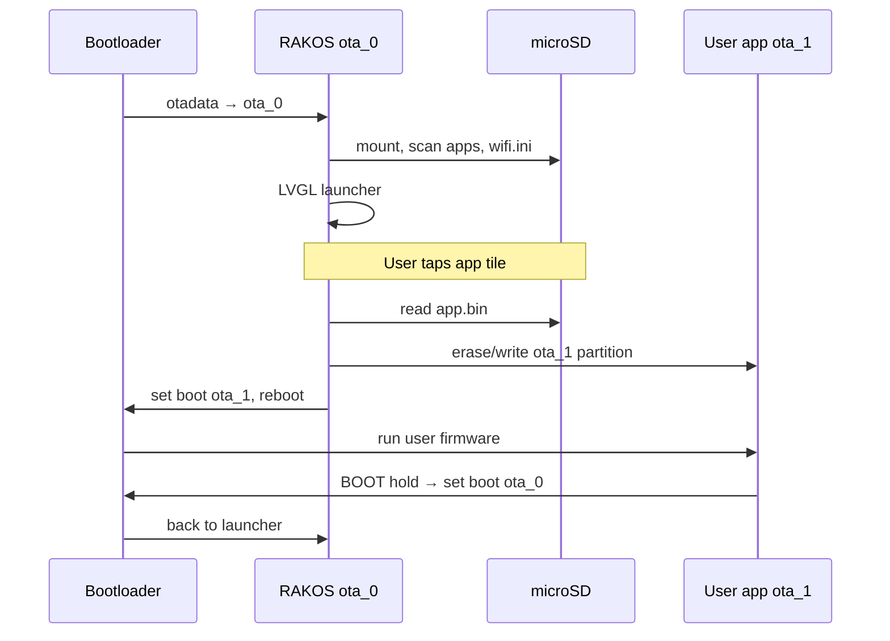

# RAKOS Design Background & Principles

## Background

RAKOS is an **ESP32-S3 launcher operating system** for the [Waveshare ESP32-S3-Touch-AMOLED-1.8](https://www.waveshare.com/wiki/ESP32-S3-Touch-AMOLED-1.8) (368×448 AMOLED + touch). It is inspired by **[kodeOS](https://docs.kode.diy/en/kodeOS/apps)** on the Kode Dot: treat firmware projects as **installable apps** on microSD, launch from a graphical UI, and return to the OS without reflashing the whole device.

RAKOS is **not** a full general-purpose OS (no MMU processes, no filesystem on flash for apps). It is a **thin launcher + BSP + dual-OTA runtime** suitable for embedded makers who already use PlatformIO/Arduino.

### Design goals

1. **OS / app separation** — RAKOS lives in `ota_0`; user code runs in `ota_1`.
2. **SD-first distribution** — Apps ship as `app.bin` under category folders on TF card.
3. **Familiar toolchain** — Build apps with PlatformIO; no proprietary IDE required.
4. **Hardware abstraction** — `rakos_bsp` isolates board pins, display, touch, PMIC, SD, audio.
5. **Safe return to OS** — User apps link `rakos_app_policy` so reset/boot returns to launcher.
6. **Incremental product UX** — Move toward kodeOS-style grid launcher, WiFi, clock (v0.2+).

### Non-goals (current)

- Multitasking user apps or multiple concurrent `ota_1` images
- On-device USB “Create App” wizard (planned; see [comparison.md](comparison.md))
- App Store / wireless app sharing
- POSIX or scripting shell

---

## Architecture overview

```text
+--------------------------------------------------+
|  src/main.cpp, rtos_app.cpp   FreeRTOS tasks     |
|  src/ui/launcher_ui*          LVGL launcher UI    |
+--------------------------------------------------+
|  lib/rakos_apps               SD AppRegistry      |
|  lib/rakos_core               BootManager, OsConfig|
|  lib/rakos_bsp                Display, SD, WiFi…  |
|  lib/rakos_app_policy         (user apps only)    |
+--------------------------------------------------+
|  Flash (partitions_rakos.csv)                    |
|    ota_0 @ 0x20000    RAKOS firmware             |
|    ota_1 @ 0x400000   One user app slot           |
|    storage            SPIFFS (/spiffs)             |
|  microSD              /Games/.../app.bin, wifi.ini|
+--------------------------------------------------+
```

See also [ARCHITECTURE.md](../ARCHITECTURE.md) for pin maps and service tables.

---

## Boot and app lifecycle



### Principles

| Principle | Implementation |
|-----------|------------------|
| Single active user slot | Only `ota_1` (8 MB); switching apps reflashes this region |
| App discoverability | `AppRegistry` scans `General/`, `Games/`, … on SD |
| No silent OTA rollback | User apps wrap `esp_ota_mark_app_valid_cancel_rollback` |
| Config layers | NVS (`OsConfig`, `RadioService`) + optional `wifi.ini` on SD |
| UI thread safety | LVGL runs in dedicated task; storage events signal UI refresh |

---

## Software layers

### `rakos_core`

- **BootManager** — `ota_0` / `ota_1` selection, `esp_ota_set_boot_partition`, reboot
- **OsConfig** — `Maker` / `Managed` mode in NVS (behavior wiring incomplete in v0.2)

### `rakos_apps`

- **AppRegistry** — Walks SD categories; each app folder may contain `app.bin`
- Paths on AMOLED: VFS root `/` → `/Games/Hello/app.bin` (not `/sdcard/Games/...`)

### `rakos_bsp`

- **DisplayManager** — LVGL 9 (AMOLED) or LVGL 8 (LCD-5)
- **StorageService** — SPIFFS + SDMMC 1-bit (AMOLED) or SPI SD (LCD-5)
- **RadioService** — WiFi STA, BLE advertise, NTP after connect
- **wifi_sd_config** — Parse `wifi.ini` from SD

### `src/ui`

- **launcher_ui** — Shell: status bar, nav, Home / Apps / Setup / Info
- **launcher_ui_appgrid** — Icon grid (`RAKOS_UI_APP_GRID`), paging, Flash / SD Scan tiles

### User apps (`examples/*App`)

- Built for `ota_1` partition layout (`partitions_app.csv`)
- Use `rakos::AppRuntime` for display, touch, exit-to-OS
- Package: `examples/<App>/dist/app.bin` → SD

---

## Partition table

| Name | Offset | Size | Role |
|------|--------|------|------|
| `ota_0` | `0x20000` | ~4 MB | RAKOS OS |
| `ota_1` | `0x400000` | 8 MB | User application |
| `storage` | `0xC00000` | 4 MB | SPIFFS (OS config cache) |

Factory image for AMOLED upload: `RAKOS-AppUI.factory.bin` @ flash `0x0` (bootloader + partition table + OS).

---

## FreeRTOS task model

| Task | Core | Role |
|------|------|------|
| `lvgl` | 1 | Input, LVGL timer, launcher `update()` |
| `storage` | 0 | SD/SPIFFS init, registry, radio boot WiFi |
| `sensor` | 0 | SD hotplug poll, IMU samples |

---

## Configuration files

| File | Location | Purpose |
|------|----------|---------|
| `wifi.ini` | TF card root | `ssid=` / `password=` — auto-connect on boot |
| `partitions_rakos.csv` | Repo root | OS flash layout |
| `partitions_app.csv` | Per example | User app layout (`ota_1` @ `0x400000`) |

---

## Versioning

Current version: see [VERSION](../VERSION) and [CHANGELOG](../CHANGELOG.md).

Recommended OS build env for AMOLED with app grid: **`rakos_os_appui`**.

---

## Roadmap (aligned with kodeOS gaps)

1. App package metadata (`manifest.json`, icon PNG)
2. Category-first navigation UI
3. Maker mode: USB upload → Run / Create App on device
4. Reduce flash churn (cache or multi-bank apps)
5. App sharing / store (long term)

Details: [comparison.md](comparison.md).
