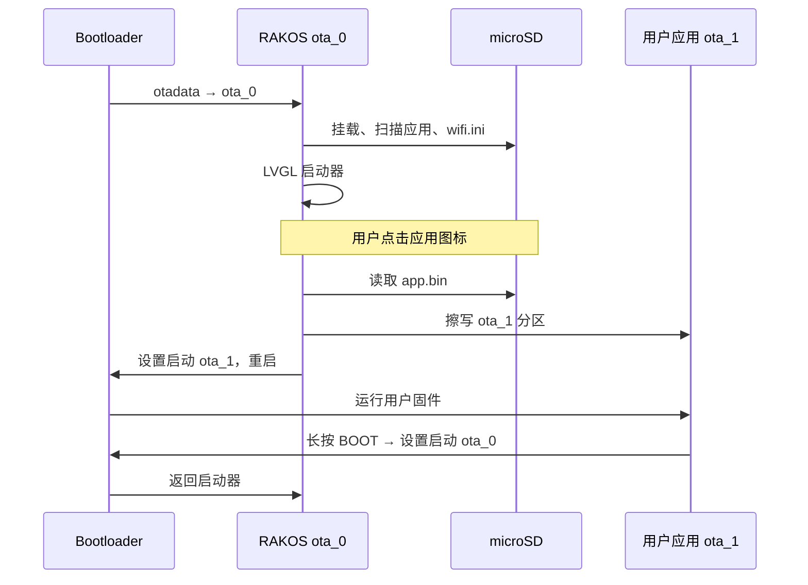

# RAKOS 设计背景与原理

[English](design.md)

## 背景

RAKOS 是面向 [Waveshare ESP32-S3-Touch-AMOLED-1.8](https://www.waveshare.com/wiki/ESP32-S3-Touch-AMOLED-1.8)（368×448 AMOLED + 触摸）的 **ESP32-S3 启动器操作系统**。设计灵感来自 Kode Dot 上的 **[kodeOS](https://docs.kode.diy/en/kodeOS/apps)**：将固件工程视为 microSD 上的**可安装应用**，从图形界面启动，无需整片重刷即可返回 OS。

RAKOS **不是**通用操作系统（无 MMU 进程、Flash 上不存放应用文件系统）。它是面向已使用 PlatformIO/Arduino 的嵌入式开发者的**轻量启动器 + BSP + 双 OTA 运行时**。

### 设计目标

1. **OS / 应用分离** — RAKOS 位于 `ota_0`；用户代码运行在 `ota_1`。
2. **SD 优先分发** — 应用以 `app.bin` 形式放在 TF 卡分类目录下。
3. **熟悉工具链** — 用 PlatformIO 编译应用，无需专有 IDE。
4. **硬件抽象** — `rakos_bsp` 隔离板级引脚、显示、触摸、电源、SD、音频。
5. **安全返回 OS** — 用户应用链接 `rakos_app_policy`，复位/启动可回到启动器。
6. **渐进式产品体验** — 向 kodeOS 风格网格启动器、WiFi、时钟演进（v0.2+）。

### 非目标（当前）

- 用户应用多任务或多个并发 `ota_1` 镜像
- 设备端 USB「创建应用」向导（规划中，见 [comparison.zh-CN.md](comparison.zh-CN.md)）
- 应用商店 / 无线应用分享
- POSIX 或脚本 Shell

---

## 架构概览

```text
+--------------------------------------------------+
|  src/main.cpp, rtos_app.cpp   FreeRTOS 任务      |
|  src/ui/launcher_ui*          LVGL 启动器 UI      |
+--------------------------------------------------+
|  lib/rakos_apps               SD AppRegistry      |
|  lib/rakos_core               BootManager, OsConfig|
|  lib/rakos_bsp                显示、SD、WiFi…     |
|  lib/rakos_app_policy         （仅用户应用）       |
+--------------------------------------------------+
|  Flash (partitions_rakos.csv)                    |
|    ota_0 @ 0x20000    RAKOS 固件                 |
|    ota_1 @ 0x400000   单一用户应用槽位            |
|    storage            SPIFFS (/spiffs)             |
|  microSD              /Games/.../app.bin, wifi.ini|
+--------------------------------------------------+
```

引脚与服务表见 [ARCHITECTURE.md](../ARCHITECTURE.md)。

---

## 启动与应用生命周期



### 设计原则

| 原则 | 实现 |
|------|------|
| 单一活动用户槽位 | 仅 `ota_1`（8 MB）；切换应用会重刷该区域 |
| 应用可发现性 | `AppRegistry` 扫描 SD 上 `General/`、`Games/` 等 |
| 禁止静默 OTA 回滚 | 用户应用包装 `esp_ota_mark_app_valid_cancel_rollback` |
| 配置分层 | NVS（`OsConfig`、`RadioService`）+ SD 可选 `wifi.ini` |
| UI 线程安全 | LVGL 在独立任务运行；存储事件通知 UI 刷新 |

---

## 软件分层

### `rakos_core`

- **BootManager** — `ota_0` / `ota_1` 选择、`esp_ota_set_boot_partition`、重启
- **OsConfig** — NVS 中 `Maker` / `Managed` 模式（v0.2 行为接线未完成）

### `rakos_apps`

- **AppRegistry** — 遍历 SD 分类目录；每个应用文件夹可含 `app.bin`
- AMOLED 路径：VFS 根 `/` → `/Games/Hello/app.bin`（非 `/sdcard/Games/...`）

### `rakos_bsp`

- **DisplayManager** — LVGL 9（AMOLED）或 LVGL 8（LCD-5）
- **StorageService** — SPIFFS + SDMMC 1-bit（AMOLED）或 SPI SD（LCD-5）
- **RadioService** — WiFi STA、BLE 广播、连接后 NTP
- **wifi_sd_config** — 从 SD 解析 `wifi.ini`

### `src/ui`

- **launcher_ui** — 外壳：状态栏、导航、主页 / 应用 / 设置 / 信息
- **launcher_ui_appgrid** — 图标网格（`RAKOS_UI_APP_GRID`）、分页、Flash / SD Scan 磁贴

### 用户应用（`examples/*App`）

- 按 `ota_1` 分区布局编译（`partitions_app.csv`）
- 使用 `rakos::AppRuntime` 处理显示、触摸、退出回 OS
- 打包：`examples/<App>/dist/app.bin` → SD

---

## 分区表

| 名称 | 偏移 | 大小 | 作用 |
|------|------|------|------|
| `ota_0` | `0x20000` | ~4 MB | RAKOS OS |
| `ota_1` | `0x400000` | 8 MB | 用户应用 |
| `storage` | `0xC00000` | 4 MB | SPIFFS（OS 配置缓存） |

AMOLED 出厂镜像：`RAKOS-AppUI.factory.bin` @ Flash `0x0`（bootloader + 分区表 + OS）。

---

## FreeRTOS 任务模型

| 任务 | 核心 | 作用 |
|------|------|------|
| `lvgl` | 1 | 输入、LVGL 定时器、启动器 `update()` |
| `storage` | 0 | SD/SPIFFS 初始化、注册表、启动 WiFi |
| `sensor` | 0 | SD 热插拔轮询、IMU 采样 |

---

## 配置文件

| 文件 | 位置 | 用途 |
|------|------|------|
| `wifi.ini` | TF 卡根目录 | `ssid=` / `password=` — 启动自动连接 |
| `partitions_rakos.csv` | 仓库根目录 | OS Flash 布局 |
| `partitions_app.csv` | 各示例 | 用户应用布局（`ota_1` @ `0x400000`） |

---

## 版本

当前版本见 [VERSION](../VERSION) 与 [CHANGELOG](../CHANGELOG.md)。

AMOLED 推荐带应用网格的 OS 编译环境：**`rakos_os_appui`**。

---

## 路线图（对齐 kodeOS 差距）

1. 应用包元数据（`manifest.json`、PNG 图标）
2. 分类优先的导航 UI
3. Maker 模式：USB 上传 → 设备端 Run / Create App
4. 减少刷写开销（缓存或多槽应用）
5. 应用分享 / 商店（长期）

详情：[comparison.zh-CN.md](comparison.zh-CN.md)。
